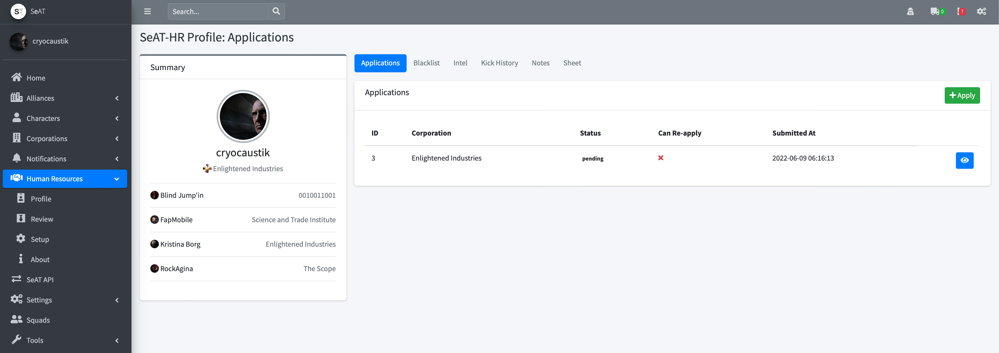

# SeAT-HR - Human Resources plugin for SeAT

[](https://packagist.org/packages/cryocaustik/seat-hr)
[](https://travis-ci.org/cryocaustik/seat-hr)
[](https://scrutinizer-ci.com/g/cryocaustik/seat-hr)
[](https://packagist.org/packages/cryocaustik/seat-hr)

Human Resources plugin for [SeAT](https://github.com/eveseat/seat) with Applications (with customized questions per corporation), Blacklist, Intel (coming soon), Kick History, Notes, and Sheet.



## SeAT v5

this branch is compatible with SeAT version 5.x - use the master branch for SeAT version 4.x

## Installation

You can install the package via composer:

```bash
composer require cryocaustik/seat-hr
```


### Changelog

Please see [CHANGELOG](CHANGELOG.md) for more information what has changed recently.

## Development

**composer**

register the package in `seat/composer.json` by adding the target version to the `require` section:

```json
{
    ...
    "require": {
        "psr-4": {
            ...
            "cryocaustik/seat-hr": "^1.0.0"
        }
    }
}
```

add your package path to the repositories section (create this section at the end, if it does not exist):
```json
{
    ...
    "repositories": [
        {
            "type": "path",
            "url": "/home/cryocaustik/dev/seat-hr/seat-hr"
        }
    ]
}
```

refresh package list through composer 
```sh
composer dumpautoload
```


### Security

If you discover any security related issues, please email seat-hr@alazy.dev instead of using the issue tracker.

## Credits

- [cryocaustik](https://github.com/cryocaustik)
- [All Contributors](../../contributors)

## License

The MIT License (MIT). Please see [License File](LICENSE.md) for more information.
