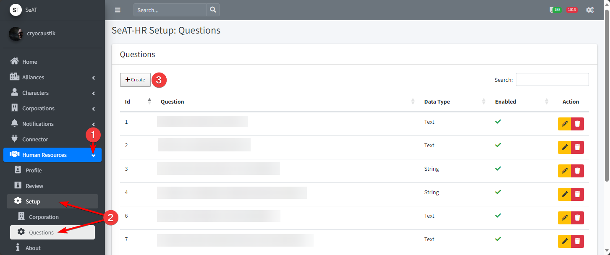

# Getting Started

This documentation outlines initial configuration of the SeAT-HR plugin:

- Configuring Corporations
- Configuring Global Questions
- Configuring Corporation Questions

## Configuring (Adding/Editing/Deleting) Corporations

Before we can do anything in the plugin, we need to first configure an appliucation, as all records will stem from this record. Vice versa, wiping out a configured corporation within the plugin, will delete all nested records as well (corp questions, applications, etc.)

### Corporation List Page

To configure a corporation, first navigate to the Corporation List page:

1. navigate to and expand the Human Resources dropdown in the nav panel
2. click on setup and then Corporation, this will take you to the corporation list page, where any pre-configured corporations will be listed and can be edited
3. click on `Add Corporation`, this will open the corporation configuration page

### Coroporation Configuraiton

Once on the corporation configuration page, fill in the form with:

1. Corporation (required):  must choost from a known corporation within the SeAT application (must be a known corporation to ensure we can pull ESI data about the corporation and applications)
2. HR Head (optional): free text field to identify contact for corporation
3. Has Restricted Questions (not yet implemented): true/false (will be used in future development)
4. Accepting Applications (required): true/false to indicate if this corporation should allow users to apply to it. This will enable/disable the ability for users to apply to the corporation (e.g. disable for wartime)
5. Click `Save` to save the corporation configuration and return tot he corporation list page

### Editing/Deleting Corporation Configuration

From the corporation list page, click on either

1. Yellow pencil icon to edit corporation
2. Red trash icon to deelete the corporation. ****NOTE: this will permanently delete all related plugin data**

## Configuring Global Questions

Questions are first configured gloablly, allowing them to be used across multiple corporations or deactivated for specific corporations.

### Global Questions Page

To configure global questions:

1. navigate to and expand the Human Resources dropdown in the nav panel
2. click on setup and then Questions, this will take you to the global questions list page, where any pre-configured questions will be listed and can be edited
3. click on `Add Question`, this will open the question configuration page

!!! Disabling a question in Global Configuration will not automatically disable it for all corporations; it will simply prevent it from being added to any future corporations. To disable the question for a corporation, see  [#configuring-corporation-questions]

### Configure Global Question

Once on the global question configuration page, fill int he form with:

1. Question (required): question name that will be displayed on the application
2. Data Type (required): data type of the question, which will change the form input field
   1. Boolean: true/false toggle input field
   2. Date: date only input field with date selector 
   3. Date Time: date and time input field with date and time selector
   4. String: single line string input field
   5. Text: multi-line text input field
3. Enabled? (required): true/false toggle that will enable/disable the ability to assign this question to corporations
4. Click `Save` to save the question configuration

## Configuring Corporation Questions

Once a corporation has been configured, you can assign which questions you want to be tied to the particular corporation's application.

You might have 10 global questions, but only want 6 of those to appear for a specific corporation; or maybe you have two variations of questions that you want to use for different corporations; this is where you configure that.

### Corportation Questions Page

From the corporation list page, click the teal question mark icon to open the Corporation Questions page

### Configuring Corporation Questions

Once on the corporation question configuration page, click on:

1. Blue plus icon to add the question to the corporation question list
2. Yellow stop icon to toggle the question as active/inactive
3. Red trash icon to delete the question and any related records (including answers)

